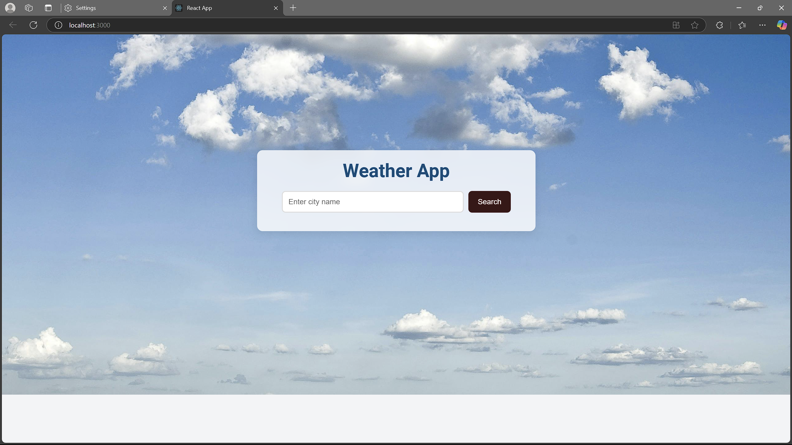
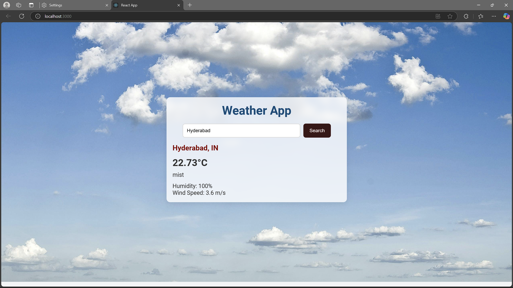

# Weather Widget

The Weather Widget is a simple and interactive application that provides real-time weather updates for any city in the world. Built using React, it leverages the OpenWeatherMap API to display current weather conditions, including temperature, humidity, wind speed, and weather descriptions.

Features as
Search by City: Enter any city name to fetch real-time weather data.
Dynamic Backgrounds: Displays weather-specific background images (e.g., sunny, cloudy, rainy).
Responsive Design: Optimized for both desktop and mobile devices.

Technologies Used
React: For building the user interface.
Axios: For API requests to the OpenWeatherMap API.
OpenWeatherMap API: For fetching weather data.
CSS: For styling and dynamic backgrounds.

Installation
Clone this repository: git clone https://github.com/srinidhi-2005/PRODIGY_WD_5.git
Navigate to the project directory: cd weather-widget
Install dependencies: npm install
Create a .env file in the root directory and add your OpenWeatherMap API key: REACT_APP_API_KEY
Start the development server: npm start

Usage
Open the application in your browser at http://localhost:3000.
Enter the name of a city in the search bar and press "Search".
View the current weather conditions and enjoy the dynamic backgrounds!

## Screenshots

